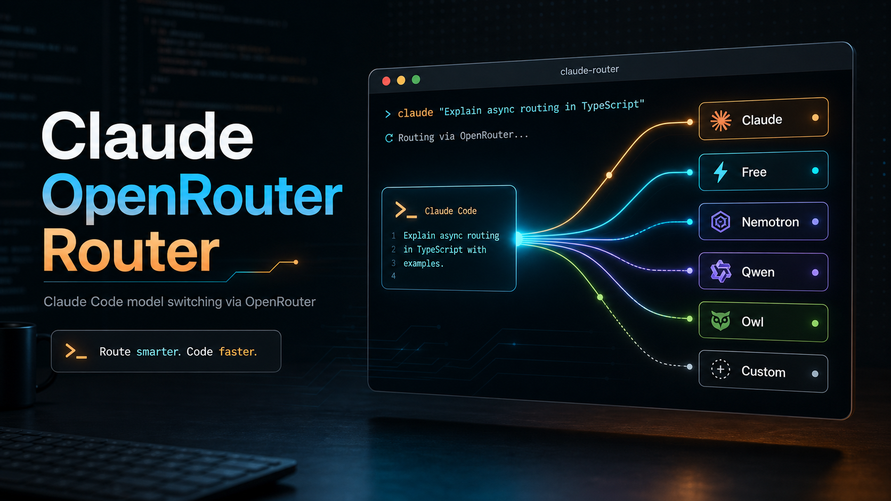

# Claude OpenRouter Router



Small shell launchers for running Claude Code through OpenRouter's Anthropic-compatible endpoint.

The goal is simple: keep Claude Code's environment clean, make provider switching obvious, and offer a safe default that follows OpenRouter's Claude Code documentation.

## What This Does

`claude-openrouter` starts Claude Code with the OpenRouter environment variables that Claude Code expects:

```bash
ANTHROPIC_BASE_URL=https://openrouter.ai/api
ANTHROPIC_AUTH_TOKEN=$OPENROUTER_API_KEY
ANTHROPIC_API_KEY=
```

The empty `ANTHROPIC_API_KEY` is intentional. OpenRouter's Claude Code guide says it must be explicitly blank so Claude Code does not try to authenticate against Anthropic directly.

## Install

One-line install:

```bash
curl -fsSL https://raw.githubusercontent.com/404kidwiz/claude-openrouter-router/main/bootstrap.sh | bash
```

Then run:

```bash
claude-openrouter --setup
```

Clone and install:

```bash
git clone https://github.com/404kidwiz/claude-openrouter-router.git
cd claude-openrouter-router
./install.sh
```

Make sure `~/.local/bin` is on your `PATH`:

```bash
export PATH="$HOME/.local/bin:$PATH"
```

Create an OpenRouter API key from the [OpenRouter API keys page](https://openrouter.ai/settings/keys), then save it locally.

Fastest setup:

```bash
claude-openrouter --setup
```

Recommended, avoids putting the key directly in shell history:

```bash
printf '%s' 'sk-or-v1-...' | claude-openrouter --set-key-stdin
```

Convenient, but may be saved in shell history:

```bash
claude-openrouter --set-key "sk-or-v1-..."
```

Check your config:

```bash
claude-openrouter --show-config
```

Then run:

```bash
claude-openrouter claude
```

If you prefer shell environment variables instead of saved config, add your OpenRouter key to your shell profile:

```bash
export OPENROUTER_API_KEY="sk-or-v1-..."
```

Restart your shell, or run:

```bash
source ~/.zshrc
```

## AI Agent Install

If you want another AI coding agent or LLM to install this for you, give it this link:

```text
https://raw.githubusercontent.com/404kidwiz/claude-openrouter-router/main/AGENT_INSTALL.md
```

That page tells the agent exactly what to run, how to verify the install, and how to handle the OpenRouter API key safely.

## Commands

Configuration:

```bash
claude-openrouter --setup
claude-openrouter --set-key "sk-or-v1-..."
printf '%s' 'sk-or-v1-...' | claude-openrouter --set-key-stdin
claude-openrouter --unset-key
claude-openrouter --set-default-profile free
claude-openrouter --set-main-model sonnet
claude-openrouter --set-base-url https://openrouter.ai/api
claude-openrouter --set-timeout 3000000
claude-openrouter --show-config
claude-openrouter --install-profile-commands
claude-openrouter --list-profile-commands
claude-openrouter --commands-dir
claude-openrouter --config-path
```

## Setup Wizard

Run the guided setup flow:

```bash
claude-openrouter --setup
```

It walks through:

- Saving an OpenRouter API key.
- Choosing a default profile such as `claude` or `free`.
- Choosing the strict Claude-mode main model, usually `sonnet`.
- Confirming the OpenRouter base URL.
- Setting the API timeout.
- Optionally adding custom OpenRouter model profiles.
- Installing generated profile commands such as `claude-ring` and `claude-qwen`.
- Running a dry-run verification.

Important: bare `claude` still launches the original Claude Code binary. Use `claude-openrouter`, `claude-ring`, `claude-qwen`, or another generated profile command to route through OpenRouter.

Strict Claude compatibility:

```bash
claude-openrouter claude
```

Lowest-cost/free OpenRouter routing:

```bash
claude-openrouter free
claude-or-free
claude-or-auto-free
```

Named OpenRouter model profiles:

```bash
claude-openrouter-claude
claude-nemotron
claude-ring
claude-owl
claude-pareto-code
claude-hunyuan
```

Generic model switcher:

```bash
claude-or-model nemotron
claude-or-model ring
claude-or-model owl
claude-or-model free
claude-or-model pareto-code
claude-or-model openrouter/owl-alpha
```

User-defined model profiles:

```bash
claude-openrouter --add-profile kimi moonshotai/kimi-k2:free
claude-openrouter --add-profile qwen qwen/qwen3-coder:free
claude-openrouter --list-profiles
claude-openrouter --install-profile-commands
claude-openrouter kimi
claude-qwen
```

You can pass normal Claude Code arguments after the profile:

```bash
claude-openrouter claude -p "Reply with exactly OK"
claude-or-model nemotron -p "Reply with exactly OK"
```

## Profiles

| Profile | Model | Compatibility |
| --- | --- | --- |
| `claude` | Anthropic first-party Claude models through OpenRouter | Best / strict |
| `free` | `openrouter/free` | Best-effort |
| `nemotron` | `nvidia/nemotron-3-super-120b-a12b:free` | Best-effort |
| `ring` | `inclusionai/ring-2.6-1t` | Best-effort |
| `owl` | `openrouter/owl-alpha` | Best-effort |
| `pareto-code` | `openrouter/pareto-code` | Best-effort |
| `hunyuan` | `tencent/hy3-preview` | Best-effort |

Claude Code is optimized for Anthropic models. The `claude` profile is the reliable default. Non-Claude OpenRouter models can work through OpenRouter's Anthropic-compatible surface, but tool use, context features, speed, and formatting may vary by model/provider.

## Custom Profiles

You can add your own OpenRouter model aliases without editing the script.

Add a profile:

```bash
claude-openrouter --add-profile kimi moonshotai/kimi-k2:free
```

Use it:

```bash
claude-openrouter kimi
claude-or-model kimi -p "Reply with exactly OK"
```

List profiles:

```bash
claude-openrouter --list-profiles
```

Remove a profile:

```bash
claude-openrouter --remove-profile kimi
```

Custom profiles are stored here by default:

```bash
~/.config/claude-openrouter-router/profiles
```

The file format is intentionally boring:

```text
profile-name=provider/model-id
```

Example:

```text
kimi=moonshotai/kimi-k2:free
qwen=qwen/qwen3-coder:free
```

To store profiles somewhere else:

```bash
export CLAUDE_OPENROUTER_CONFIG_DIR="$HOME/.config/my-openrouter-profiles"
```

## Generated Commands

The router can create real terminal commands for every built-in and custom profile:

```bash
claude-openrouter --install-profile-commands
```

Examples:

```bash
claude-ring
claude-owl
claude-nemotron
claude-pareto-code
claude-qwen
```

List what would be available:

```bash
claude-openrouter --list-profile-commands
```

By default commands are written to:

```bash
~/.local/bin
```

Change that with:

```bash
export CLAUDE_OPENROUTER_COMMANDS_DIR="$HOME/bin"
```

The generated commands intentionally do not replace `claude`. That keeps the original Claude Code command untouched and avoids confusing recursion. If you want OpenRouter routing, call `claude-openrouter` or a generated command such as `claude-ring`.

## Dry Run

Preview what will be launched without starting Claude Code:

```bash
claude-openrouter --dry-run claude
claude-openrouter --dry-run nemotron
```

Print the environment mapping:

```bash
claude-openrouter --print-env free
```

Secrets are redacted from dry-run output.

## Configuration

Easy path:

```bash
claude-openrouter --setup
```

Manual path:

```bash
claude-openrouter --set-key "sk-or-v1-..."
printf '%s' 'sk-or-v1-...' | claude-openrouter --set-key-stdin
claude-openrouter --set-default-profile claude
claude-openrouter --show-config
```

Saved configuration lives here:

```bash
~/.config/claude-openrouter-router/config
```

The file is written with `0600` permissions and uses simple `KEY=value` lines:

```text
OPENROUTER_API_KEY=sk-or-v1-...
CLAUDE_OPENROUTER_DEFAULT_PROFILE=claude
CLAUDE_OPENROUTER_MAIN_MODEL=sonnet
CLAUDE_OPENROUTER_BASE_URL=https://openrouter.ai/api
API_TIMEOUT_MS=3000000
```

Advanced environment-variable path:

```bash
export OPENROUTER_API_KEY="sk-or-v1-..."
```

Optional environment variables:

```bash
export CLAUDE_OPENROUTER_DEFAULT_PROFILE=claude
export CLAUDE_OPENROUTER_COMMANDS_DIR="$HOME/.local/bin"
export CLAUDE_OPENROUTER_MAIN_MODEL=sonnet
export CLAUDE_OPENROUTER_BASE_URL=https://openrouter.ai/api
export CLAUDE_OPENROUTER_CONFIG_DIR="$HOME/.config/claude-openrouter-router"
export API_TIMEOUT_MS=3000000
```

Environment variables override saved config. Saved config overrides built-in defaults.

Configuration command reference:

```bash
claude-openrouter --setup                             # Guided first-run setup
claude-openrouter --set-key "sk-or-v1-..."          # Save OpenRouter API key
claude-openrouter --set-key-stdin                   # Read OpenRouter API key from stdin
claude-openrouter --unset-key                       # Remove saved API key
claude-openrouter --set-default-profile free        # Change default profile
claude-openrouter --set-main-model sonnet           # Main Claude Code model for strict Claude mode
claude-openrouter --set-base-url https://openrouter.ai/api
claude-openrouter --set-timeout 3000000
claude-openrouter --show-config                     # Redacts secrets
claude-openrouter --install-profile-commands        # Create claude-ring, claude-qwen, etc.
claude-openrouter --list-profile-commands           # Preview generated command names
claude-openrouter --commands-dir                    # Prints command install directory
claude-openrouter --config-path                     # Prints config file path
```

## Recommended Usage

Use this when you care most about Claude Code compatibility:

```bash
claude-openrouter claude
```

Use this when you care most about lowest-cost/free routing and accept best-effort compatibility:

```bash
claude-openrouter free
```

Use named wrappers when you are experimenting with specific OpenRouter models:

```bash
claude-nemotron
claude-ring
claude-owl
claude-pareto-code
```

## Suggested Improvements

Good next enhancements:

- Add `claude-openrouter doctor` to check `claude`, `PATH`, config permissions, OpenRouter connectivity, and selected model availability.
- Add `claude-openrouter update` to rerun `bootstrap.sh` from the installed checkout.
- Add shell completions for profiles and config commands.
- Add model metadata caching from OpenRouter so users can search models from the terminal.
- Add signed release archives or Homebrew packaging once the CLI stabilizes.
- Add CI with shellcheck, install smoke tests, and scripted setup tests.

## Troubleshooting

If a command is not found:

```bash
export PATH="$HOME/.local/bin:$PATH"
rehash
```

If Claude Code authenticates against Anthropic instead of OpenRouter, check:

```bash
claude-openrouter --print-env claude
```

You should see:

```bash
ANTHROPIC_BASE_URL=https://openrouter.ai/api
ANTHROPIC_API_KEY=
ANTHROPIC_AUTH_TOKEN=<redacted>
```

If a non-Claude profile behaves strangely, retry with:

```bash
claude-openrouter claude
```

That profile uses Anthropic first-party Claude models through OpenRouter and is the intended compatibility path.

## References

- [OpenRouter Claude Code integration](https://openrouter.ai/docs/cookbook/coding-agents/claude-code-integration)
- [OpenRouter models](https://openrouter.ai/models)
- [Claude Code](https://code.claude.com)
